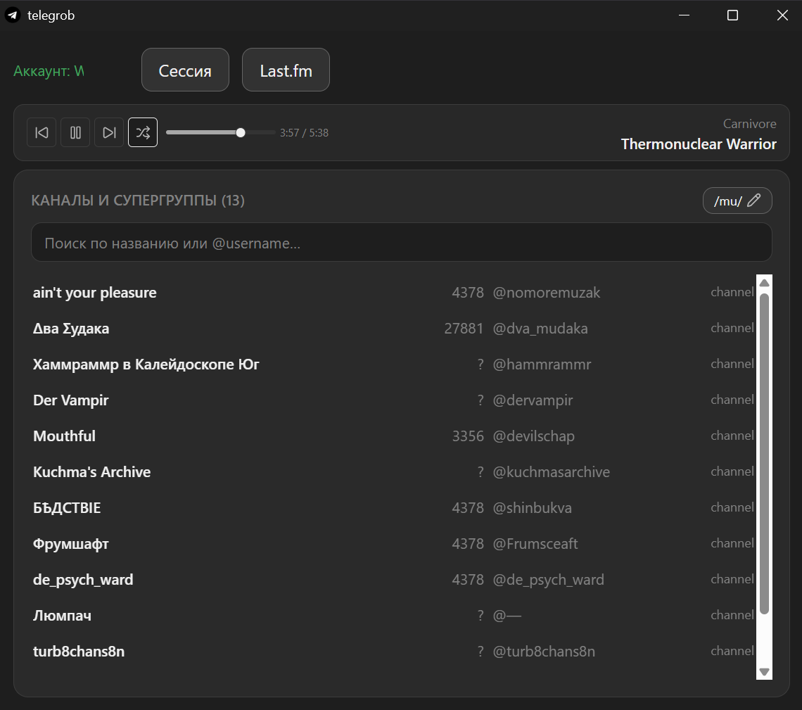
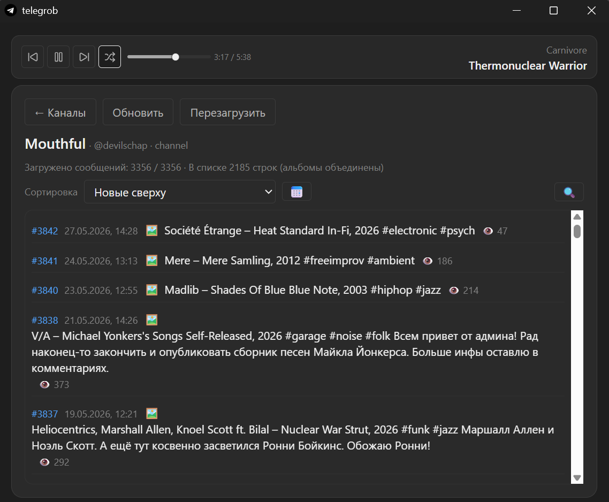

# Telegrob

Кастомный телеграм клиент с расширенным функционалом плеера с ластфм скробблером + возможностью сортировать посты в канале по популярности и другие понадобившиеся мне функции

- Вход по QR.
- Каталог постов в SQLite; навигация и ссылки на посты.
- Скачивание медиа и массовая выгрузка аудио в выбранную папку.
- Нативное воспроизведение музыки из постов (буфер, очередь, seek).
- Глобальная очередь и трей.

## Screenshots

<table style="width:100%;border-collapse:collapse;">
	<tr>
		<td style="width:50%;padding:4px;vertical-align:top;">
			
		</td>
		<td style="width:50%;padding:4px;vertical-align:top;">
			
		</td>
	</tr>
</table>

## Структура проекта

```
src/
├── App.tsx
├── main.tsx
├── globals.css
├── window.css
├── vite-env.d.ts
├── assets/
├── shared/
├── components/
│   ├── auth-session/
│   │   ├── auth.tsx
│   │   ├── index.tsx
│   │   └── session.tsx
│   ├── channel-view/
│   │   ├── channel-music-progress-slider.tsx
│   │   ├── channel-post-group.tsx
│   │   ├── channel-post.tsx
│   │   ├── channel-toolbar-filter.tsx
│   │   ├── channel-toolbar-load.tsx
│   │   ├── index.tsx
│   │   └── posts-list.tsx
│   ├── modals/
│   │   ├── auth-session-modal.tsx
│   │   ├── channel-catalog-filters-modal.tsx
│   │   ├── channels-folder-modal.tsx
│   │   ├── download-path-modal.tsx
│   │   ├── index.tsx
│   │   └── lastfm-auth-modal.tsx
│   ├── ui/
│   │   ├── button.tsx
│   │   ├── calendar.tsx
│   │   └── popover.tsx
│   ├── channels.tsx
│   ├── global-music-queue-bar.tsx
│   ├── lastfm-music-bridge.tsx
│   └── require-session.tsx
├── db/
│   ├── CachedChannelsDB.ts
│   ├── ChannelHistoryCheckpointDB.ts
│   ├── ChannelPostsDB.ts
│   ├── index.ts
│   ├── migrate.ts
│   ├── migrations/
│   │   ├── index.ts
│   │   └── types.ts
│   ├── schema.ts
│   └── utils.ts
├── hooks/
│   ├── use-auth.ts
│   ├── use-channel-music-player.ts
│   ├── use-channels-context-menu.ts
│   ├── use-load-posts-data.ts
│   ├── use-modal.ts
│   └── use-session.ts
├── pages/
│   ├── channel-page.tsx
│   └── home-page.tsx
└── store/
    ├── main/
    │   ├── channel-view/
    │   ├── index.ts
    │   ├── lastfm-auth/
    │   ├── music-player/
    │   └── session/
    └── modal/
        ├── index.ts
        └── keys.ts

src-tauri/
└── src/
    ├── lastfm/
    ├── telegram/
    ├── app_tray.rs
    ├── lib.rs
    └── main.rs
```

## Technologies

- React, TypeScript, Vite
- Tauri for desktop
- grammers, Drizzle, SQLite, TailwindCSS, Zustand
